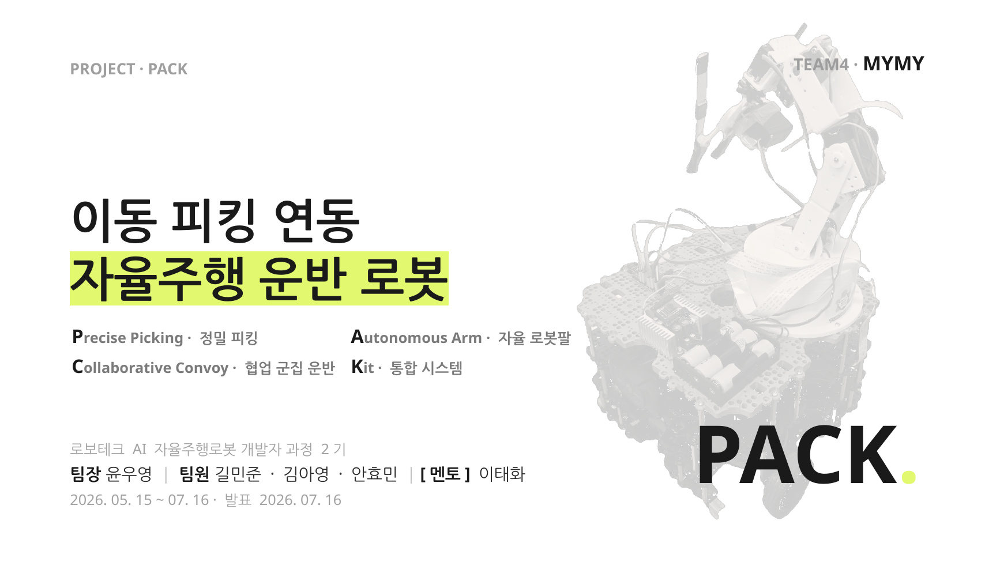
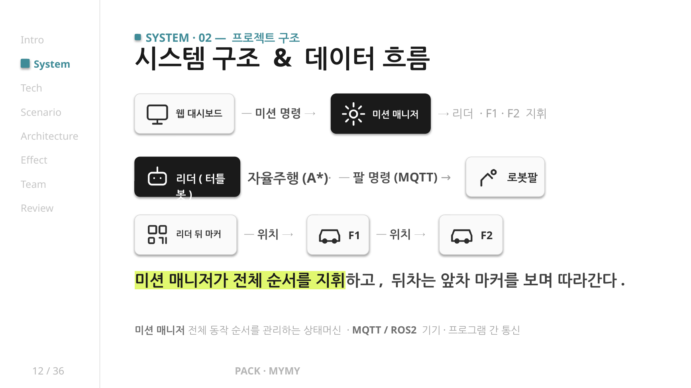
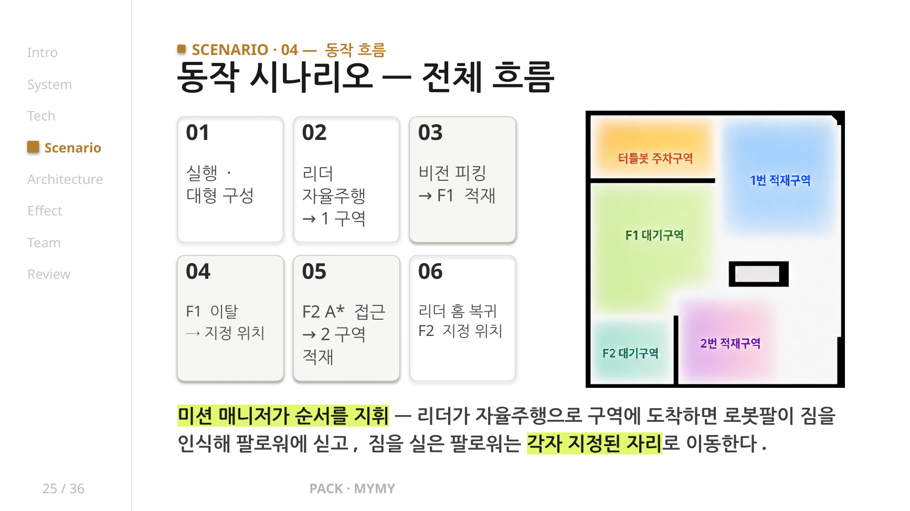
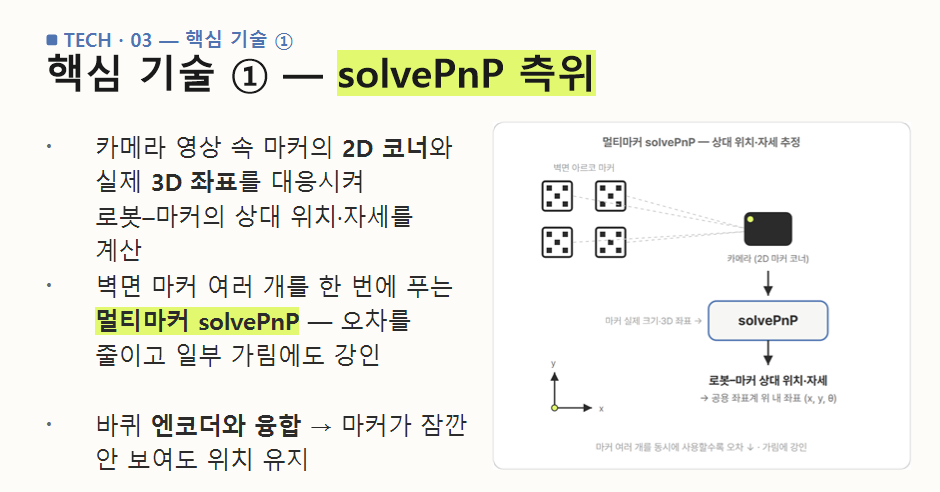
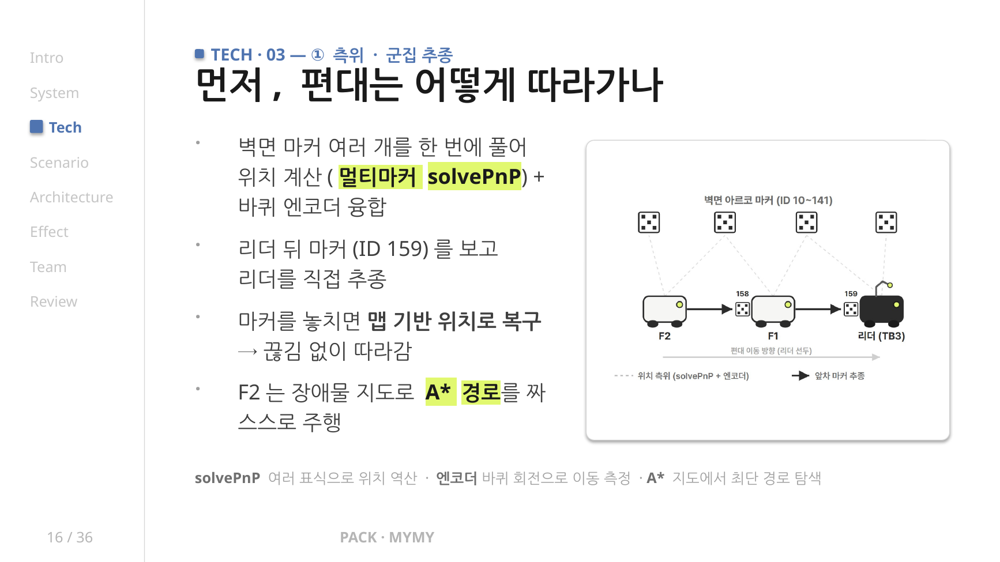
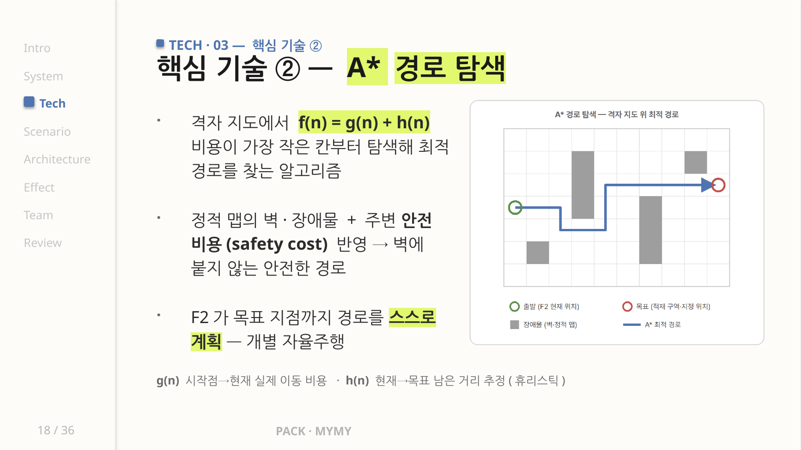
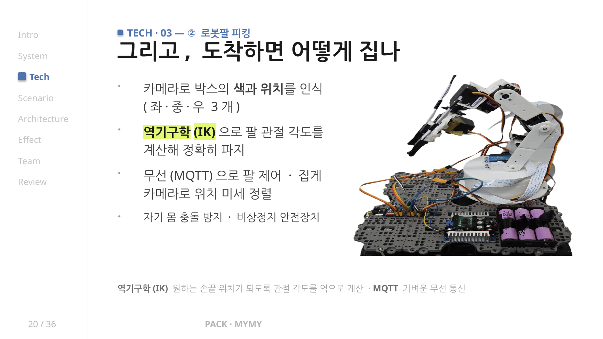
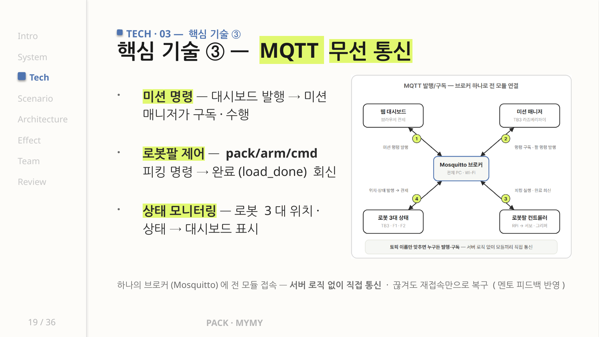
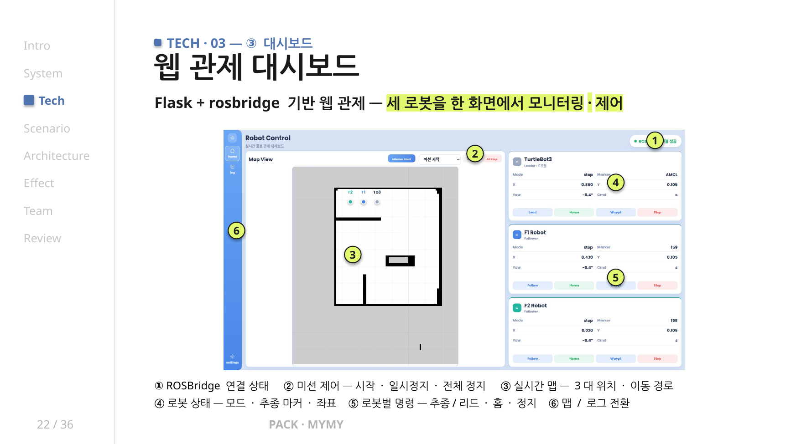

# PACK — 이동 피킹 연동 자율주행 운반 로봇

<p align="center">
  <strong>ROS2 기반 리더 로봇과 팔로워 로봇이 협업하여 물체를 자동 피킹하고 지정 위치까지 운반하는 다중 로봇 시스템</strong>
</p>

<p align="center">
  
  
  
  
  
  
</p>

<p align="center">
  <code>ROS2 Humble</code> · <code>Multi-Robot</code> · <code>Robot Arm</code> · <code>ArUco</code> · <code>solvePnP</code> · <code>MQTT</code> · <code>A*</code>
</p>

---

## 프로젝트 소개

기존 자동화 설비는 다수의 산업용 로봇팔과 고정형 컨베이어 중심으로 구성되어 초기 도입 비용과 공간 제약이 크다는 한계가 있습니다.

PACK은 고가의 피킹 장비는 리더 로봇 1대에 집중하고, 운반 작업은 저비용 팔로워 로봇 여러 대가 분담하는 구조로 설계한 이동 피킹 기반 다중 자율주행 운반 시스템입니다.

리더 로봇(TurtleBot3 Waffle Pi + 자체 제작 6축 로봇팔)은 자율주행으로 작업 구역에 이동한 뒤 비전 피킹으로 물체를 집어 팔로워 로봇에 적재합니다. F1, F2 팔로워 로봇은 ArUco 마커와 엔코더 데이터를 활용해 자기 위치를 추정하고, 지정 위치까지 추종 또는 자율 이동을 수행합니다.

<p align="center">
  
</p>

---

## 프로젝트 정보

| 항목 | 내용 |
| --- | --- |
| 프로젝트명 | PACK: 이동 피킹 연동 자율주행 운반 로봇 |
| 개발 기간 | 2026.05.15 ~ 2026.07.16 |
| 팀 | 4조 MYMY |
| 역할 | 팀장 |
| 주요 담당 | 리더 자율주행, 미션 상태머신, 다중 로봇 통합, 시나리오 설계 및 발표 |
| 교육 과정 | 로보테크 AI 자율주행로봇 개발자 과정 2기 최종 프로젝트 |

---

## 기술 스택

| 구분 | 기술 |
| --- | --- |
| Language | Python 3.10 |
| OS | Ubuntu 22.04 |
| Framework | ROS2 Humble, Flask |
| Navigation | Nav2, AMCL, A*, Pure Pursuit |
| Vision | OpenCV, ArUco, solvePnP |
| Communication | MQTT, rosbridge |
| Hardware | TurtleBot3 Waffle Pi, 6축 Robot Arm, Arduino UNO, PCA9685, 4WD Encoder |

---

## 시스템 구성

<p align="center">
  
</p>

| 구성 | 역할 | 주요 하드웨어 / 기술 |
| --- | --- | --- |
| Leader Robot | 자율주행, 피킹, 미션 지휘 | TurtleBot3 Waffle Pi, 6축 로봇팔, Pi Camera |
| F1 | 리더 후면 마커 추종, 적재 후 지정 위치 이동 | Arduino 4WD, Encoder, Raspberry Pi, USB Camera |
| F2 | F1 추종, A* 기반 접근 및 지정 위치 이동 | Arduino 4WD, Encoder, Raspberry Pi, USB Camera |
| Robot Arm | 물체 인식, IK 기반 피킹, 팔로워 적재 | Arduino, PCA9685, Servo, Gripper |
| Dashboard | 미션 명령, 상태 모니터링, 로봇 제어 | Flask, rosbridge, Web UI |
| Communication | 미션 명령, 로봇팔 제어, 상태 공유 | MQTT, ROS2 Topic |

---

## 담당 역할

### 1. ROS2 기반 리더 로봇 자율주행 및 미션 제어

- Nav2와 AMCL 기반 리더 로봇 자율주행 구현
- 미션 상태머신(State Machine)을 활용한 작업 순서 제어
- 리더와 팔로워 간 협업 시나리오 설계 및 통합 테스트

### 2. 다중 로봇 추종 및 위치 추정 시스템 구현

- ArUco Marker와 solvePnP 기반 위치 추정 구현
- 엔코더 데이터를 융합하여 위치 정확도 향상
- F1, F2 팔로워 로봇의 추종 및 자율 이동 기능 구현

### 3. 로봇팔 피킹 시스템 구현

- 6축 로봇팔 역기구학(IK) 기반 피킹 및 적재 기능 구현
- 카메라 기반 물체 위치 인식 및 그리퍼 제어
- 피킹 시퀀스 최적화 및 적재 동작 안정화

### 4. 시스템 통합 및 프로젝트 관리

- ROS2, MQTT, Flask 기반 다중 로봇 시스템 통합
- 웹 대시보드에서 미션 명령 전송 및 로봇 상태 실시간 모니터링
- 전체 시스템 통합 테스트와 통신 안정화 및 프로젝트 팀장 역할 수행

---

## 미션 시나리오

<p align="center">
  
</p>

```text
FORMATION_WAIT
  ↓
GO_TO_LOAD_1
  ↓
비전 피킹 → F1 적재
  ↓
F1_LOAD_EXIT_ROTATE / F1_LOAD_EXIT_SETTLE
  ↓
F1_TO_HOME
  ↓
F2_ASTAR_TO_LOAD2_APPROACH
  ↓
TB3_TO_LOAD2_WP1
  ↓
F2_FINAL_MARKER_FOLLOW
  ↓
WAIT_LOAD_2 → F2 적재
  ↓
HOME_RETURNING
  ↓
MISSION_COMPLETE
```

웹 대시보드에서 미션을 시작하면 리더 로봇이 선두에서 작업 구역으로 이동하고, 팔로워 로봇은 앞차의 마커를 기준으로 추종합니다. 작업 구역에 도착하면 로봇팔이 물체를 인식하여 팔로워에 적재하고, 적재가 완료된 팔로워는 지정 위치로 이동합니다.

---

## 핵심 기술

### 1. ArUco + solvePnP 기반 위치 추정

<p align="center">
  
</p>

- 카메라 영상 속 ArUco Marker의 2D 코너와 실제 3D 좌표를 대응시켜 로봇의 위치와 자세를 추정
- 벽면 마커 여러 개를 동시에 사용하는 멀티마커 solvePnP 방식 적용
- 엔코더 오도메트리와 융합하여 마커가 일시적으로 보이지 않아도 위치 유지

### 2. 다중 로봇 추종 및 자율 이동

<p align="center">
  
</p>

- F1은 리더 후면 마커(ID 159)를 기준으로 추종
- F2는 F1 후면 마커(ID 158)를 기준으로 추종 후, 필요 시 리더 마커로 재타겟
- 마커를 놓치는 상황에서는 맵 기반 위치와 엔코더 데이터를 활용해 복구
- F2는 A* 기반 경로 계획을 통해 접근점과 지정 위치까지 자율 이동

### 3. A* 경로 탐색 및 Pure Pursuit 경로 추종

<p align="center">
  
</p>

- 정적 맵의 벽과 장애물을 고려한 격자 기반 경로 탐색
- 장애물 주변에 Safety Cost를 적용하여 벽에 지나치게 가까운 경로 방지
- Pure Pursuit 제어를 통해 계산된 경로를 부드럽게 추종
- 목표 지점 접근 시 속도와 회전량을 조절하여 주행 안정성 개선

### 4. 로봇팔 비전 피킹

<p align="center">
  
</p>

- eye-in-hand 카메라로 박스의 색상과 위치 인식
- 픽셀 좌표를 로봇팔 기준 좌표로 변환
- 역기구학(IK)을 기반으로 관절 각도를 계산하여 피킹 수행
- 그리퍼 제어를 통해 물체를 파지하고 팔로워 로봇에 적재
- 비상정지와 충돌 방지 조건을 적용하여 하드웨어 안정성 확보

### 5. MQTT 기반 시스템 통합

<p align="center">
  
</p>

- Mosquitto MQTT Broker를 중심으로 미션 매니저, 로봇팔, 웹 대시보드 및 각 로봇 모듈 연결
- 미션 명령, 로봇팔 제어, 작업 완료 메시지, 로봇 상태를 Topic 단위로 분리
- 작업 완료 메시지(load_done)를 기반으로 다음 미션 단계가 실행되도록 구성
- 일부 모듈이 일시적으로 종료되더라도 재실행 후 다시 통신에 참여할 수 있는 구조로 설계

### 6. Flask 웹 대시보드

<p align="center">
  
</p>

- 리더, F1, F2의 위치와 상태를 한 화면에서 모니터링
- 미션 시작, 일시정지, 전체 정지 기능 제공
- 로봇별 모드, 추종 마커, 좌표, 로그 확인
- rosbridge를 통해 브라우저에서 ROS2 상태를 실시간 확인

---

## 주요 MQTT Topic

| Topic | 역할 |
| --- | --- |
| `pack/arm/cmd` | 로봇팔 피킹 명령 |
| `pack/arm/status` | 로봇팔 상태 및 작업 완료 메시지 |
| `mission/cmd` | 대시보드 기반 미션 명령 |
| `/f1/relative_pose` | F1 위치 추정 결과 |
| `/f2/relative_pose` | F2 위치 추정 결과 |
| `/robot_cmd` | 팔로워 주행 명령 |
| `/goal_pose` | 팔로워 웨이포인트 목표 |

---

## 주요 문제 해결

### 1. 단일 마커 기반 위치 추정 오차

단일 ArUco 마커만 사용할 경우 근거리에서 회전값이 크게 흔들리고, 일부 마커가 가려졌을 때 위치 추정이 불안정해지는 문제가 발생했습니다.

이를 해결하기 위해 여러 마커의 코너 좌표를 동시에 사용하는 멀티마커 solvePnP 방식을 적용하고, 엔코더 오도메트리와 융합하여 마커가 일시적으로 보이지 않는 상황에서도 위치를 유지하도록 개선했습니다.

### 2. 팔로워 명령 충돌

마커 추종, 웨이포인트 이동, 회전 명령이 동시에 전달되면서 주행이 불안정해지는 문제가 발생했습니다.

Mode Manager와 Command Mux를 도입하여 현재 미션 상태에 맞는 하나의 명령만 모터 제어기로 전달되도록 구성했습니다. 이를 통해 추종, 회전, 웨이포인트 이동 명령이 충돌하는 상황을 줄였습니다.

### 3. 로봇팔 피킹 동작 불안정

카메라에서 검출한 물체 좌표와 로봇팔 기준 좌표 사이의 오차로 인해 파지 위치가 일정하지 않은 문제가 있었습니다.

카메라 좌표 변환과 서보 각도 보정을 반복 수행하고, 접근·파지·상승·적재 시퀀스를 단계별로 분리하여 피킹 동작의 안정성을 높였습니다.

### 4. 시스템 통합 시 통신 구조 복잡성

로봇 3대, 로봇팔, 웹 대시보드가 동시에 동작하면서 명령 순서와 상태 동기화가 복잡해지는 문제가 있었습니다.

MQTT 기반 발행/구독 구조를 적용하여 각 모듈을 Topic 단위로 분리하고, 작업 완료 이벤트를 기준으로 다음 미션이 진행되도록 구성했습니다.

---

## 프로젝트 결과

| 항목 | 내용 |
| --- | --- |
| 개발 성과 | 리더 로봇, 팔로워(F1·F2), 6축 로봇팔이 협업하는 이동 피킹 기반 다중 자율주행 운반 시스템 구현 |
| 구현 기능 | 리더 자율주행, 다중 로봇 추종, ArUco·solvePnP 위치 추정, 로봇팔 피킹 및 적재, MQTT 기반 미션 제어 |
| 기술 경험 | ROS2, Nav2, AMCL, OpenCV, solvePnP, A*, Pure Pursuit, MQTT, Flask를 연동한 통합 시스템 구축 |
| 최종 결과 | 웹 대시보드를 통한 실시간 미션 제어와 리더·팔로워·로봇팔 협업 시나리오 구현 |

---

## 저장소 구조

```text
PACK/
├── from_tb3/                     # 리더(TB3 라즈베리파이) 실행 코드
│   ├── multi_pick_v4.py          # 비전 피킹: 색 인식 → IK → 파지 → 적재
│   └── start_all.sh              # 리더 측 일괄 실행 스크립트
│
├── final_ws/                     # 리더 ROS2 워크스페이스
│   └── src/final_mission_robot/
│       ├── mission_manager.py            # 미션 상태머신
│       ├── air_clean_pure_controller.py  # 기존 프로젝트 모듈을 확장한 A* + Pure Pursuit 컨트롤러
│       ├── auto_initial_pose.py          # AMCL 초기 위치 자동 설정
│       └── config/final_params.yaml      # 노드 및 웨이포인트 파라미터
│
├── from_f1/encoder_bridge/       # F1 팔로워 ROS2 패키지
│   ├── encoder_bridge/
│   │   ├── aruco_node.py                 # 마커 검출 + 멀티마커 solvePnP 측위
│   │   ├── encoder_odom_node.py          # 엔코더 오도메트리
│   │   ├── relative_pose_node.py         # 마커·엔코더 융합 상대 위치
│   │   ├── f1_hybrid_follow_pose_node.py # 마커 우선 + 맵 보조 하이브리드 추종
│   │   ├── f1_mode_manager_node.py       # 모드 관리
│   │   └── waypoint_drive_node.py        # 웨이포인트 주행
│   └── launch/f1_unified_system.launch.py
│
├── from_f2/encoder_bridge/       # F2 팔로워 ROS2 패키지
│   ├── encoder_bridge/
│   │   ├── f2_map_astar_planner_node.py  # 정적 맵 A* 경로 계획
│   │   ├── static_map_planner.py         # A* 구현
│   │   ├── robot_cmd_mux_node.py         # 명령 Mux
│   │   └── f2_mode_manager_node.py       # 모드 관리
│   └── launch/f2_unified_system.launch.py
│
├── robot_dashboard_flask/        # 웹 관제 대시보드
│   ├── app.py                    # Flask 서버
│   ├── mission_manager.py        # 대시보드 측 미션 명령 처리
│   ├── static/                   # JS, CSS, Map 이미지
│   └── templates/                # Web UI
│
├── RobotArmCase.ino              # 로봇팔 펌웨어
├── mqtt_gateway_lite.py          # MQTT → Serial 게이트웨이
├── auto_pick.py                  # 피킹 단독 실행 버전
├── f1_car.ino                    # 4WD 팔로워 펌웨어
├── map_pose_viewer_pc.py         # 마커 맵 및 로봇 위치 시각화
├── images/                       # README 이미지
└── README.md
```

---

## 실행 개요

### 1. MQTT Broker 실행

```bash
sudo apt update
sudo apt install mosquitto mosquitto-clients
sudo systemctl start mosquitto
sudo systemctl enable mosquitto
```

### 2. 리더 로봇 실행

```bash
cd final_ws
colcon build --symlink-install
source install/setup.bash
ros2 launch final_mission_robot final_mission.launch.py
```

### 3. 로봇팔 MQTT 게이트웨이 실행

```bash
python3 mqtt_gateway_lite.py
```

### 4. F1 팔로워 실행

```bash
cd from_f1/encoder_bridge
colcon build --symlink-install
source install/setup.bash
ros2 launch encoder_bridge f1_unified_system.launch.py
```

### 5. F2 팔로워 실행

```bash
cd from_f2/encoder_bridge
colcon build --symlink-install
source install/setup.bash
ros2 launch encoder_bridge f2_unified_system.launch.py
```

### 6. 웹 대시보드 실행

```bash
cd robot_dashboard_flask
pip install -r requirements.txt
./run.sh
```

---

## 팀 구성 및 역할

| 팀원 | 주요 역할 |
| --- | --- |
| 윤우영 | 팀장, 리더 자율주행, 미션 상태머신, 통합 시나리오 설계 및 발표 |
| 길민준 | 로봇팔 제어, 비전 피킹, 역기구학(IK) |
| 김아영 | ArUco 마커 맵, 위치 추정, 팔로워 추종 |
| 안효민 | MQTT 통신, Flask 웹 대시보드, 시스템 통합 테스트 |

---

## 프로젝트를 통해 배운 점

- ROS2 기반 다중 로봇 시스템을 설계하고 통합하는 경험을 쌓았습니다.
- ArUco Marker와 solvePnP를 활용한 위치 추정 및 팔로워 추종 시스템을 구현하며 비전 기반 자율주행 기술을 익혔습니다.
- 역기구학(IK)을 적용한 6축 로봇팔 제어와 피킹 시퀀스를 구현하며 이동 로봇과 로봇팔의 협업 방식을 경험했습니다.
- MQTT와 Flask를 활용하여 웹 대시보드, 로봇, 로봇팔을 하나의 시스템으로 연동하며 통합 시스템 설계 역량을 높였습니다.
- 팀장으로서 역할 분담, 일정 관리, 통합 테스트, 발표까지 프로젝트 전 과정을 경험했습니다.

---

## 향후 개선 방향

- 추종 방식 파라미터화: 환경에 따라 마커, SLAM, 라인 추종을 선택형으로 전환
- 팔로워 N대 확장: 마커 ID 기반 편대 프로토콜로 다중 팔로워 추가
- 인계·적재·하역 완전 자동화: 대시보드 수동 트리거 없이 상태머신 자동 전환
- 동적 장애물 대응: LiDAR 기반 실시간 감지 및 A* 재계획 적용
- 작업 모듈 교체: 리더의 피킹 모듈을 변경하여 물류, 농업, 병원 등 다양한 현장에 확장

---

## 참고 사항

- 본 프로젝트는 교육 과정 최종 팀 프로젝트로 진행되었습니다.
- `air_clean_pure_controller.py`는 이전 프로젝트에서 사용한 A* + Pure Pursuit 주행 모듈을 PACK 프로젝트에 맞게 확장한 파일입니다.
- 각 로봇은 동일 네트워크 및 MQTT Broker 환경에서 실행해야 합니다.
- 카메라 캘리브레이션과 ArUco 마커 좌표는 실험 환경에 맞게 설정해야 합니다.

---

<h2>시연 영상</h2>

<p align="center">
  <a href="https://youtu.be/bIvEF2X9YFs">
    
  </a>
</p>